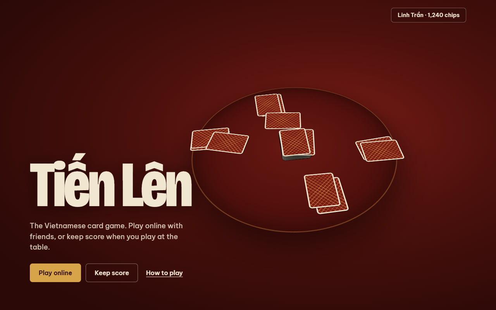
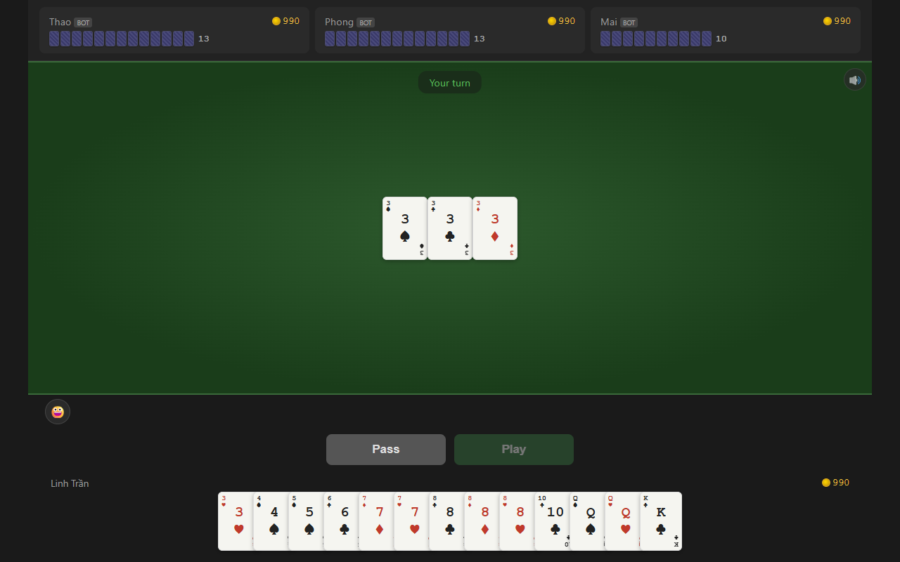
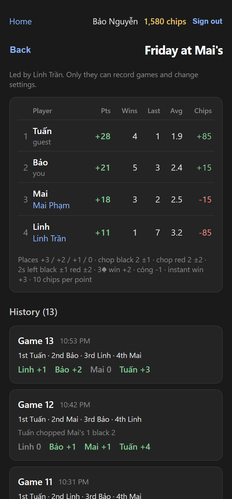
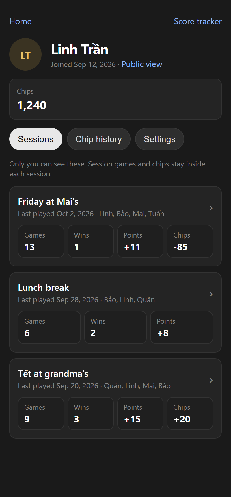

# Tiến Lên

I made this for playing Tiến Lên with my girlfriend Vy and her workmate Thư (aka clemenfahhh). We play in person a lot, and keeping score with pen and paper got old, so I built a score tracker for whenever we play.

Then I added an online version, so they can play on my site instead of on Facebook. With chips, so there's some gambling, haha.





<p>
  
  
</p>

The screenshots use made-up players.

## Built with


## How the game works

It uses a normal 52-card deck. 2 to 4 players get 13 cards each.

Cards go from 3 (lowest) up to A, then 2 (highest). When two cards have the same rank, the suit decides: ♠ < ♣ < ♦ < ♥.

Whoever has the 3♠ starts the hand and has to play it. After that, each player beats what's on the table or passes. To beat a play you need the same kind of combo, but higher. Once you pass, you sit out until the round ends. When everyone else has passed, the last person who played starts a new round with anything they want.

The first player to get rid of all their cards wins.

| Combo | Example |
|---|---|
| Single | 7♦ |
| Pair | 9♠ 9♥ |
| Triple | Q♠ Q♦ Q♥ |
| Straight, 3 or more in a row, no 2s | 5♣ 6♦ 7♠ 8♥ |
| Four of a kind | 8♠ 8♣ 8♦ 8♥ |
| Pair straight, 3 or more pairs in a row, no 2s | 4♠ 4♥ 5♣ 5♦ 6♠ 6♥ |

A straight only beats a straight of the same length. Same for pair straights.

2s are the strongest cards, but you can chop them:

| To beat | Play |
|---|---|
| A single 2 | Four of a kind, or a pair straight of 3 pairs |
| A pair of 2s | A pair straight of 4 pairs |
| Three 2s | A pair straight of 5 pairs |

You win right away (tới trắng) if you're dealt all four 2s, or a dragon: one of every card from 3 to A.

Online, everyone puts the ante in the pot at the start of each hand and the winner takes it. Quick Match uses the chips on your account. Rooms you make yourself use practice chips.

## Score tracker

Open `/scores` to start a session with 2 to 4 players. After each game, enter the finish order and any penalties. The page keeps running totals, wins and game history with undo.

Default points for 3 players:

| Event | Points |
|---|---|
| 1st / 2nd / 3rd | +2 / +1 / 0 |
| Chopping a black 2 | chopper +1, chopped player -1 |
| Chopping a red 2 | chopper +2, chopped player -2 |
| Last place left holding a black 2 | last -1, player above them +1 |
| Last place left holding a red 2 | last -2, player above them +2 |
| Winning with 3♠ as the last card | winner +2 bonus |
| Cóng (never played a card) | -1 |
| Instant win | winner +3 |

Multiple 2s add up. You can change every point value when you create a session.

## Running it

```
npm install
npm run install:all
npm run dev
```

The client runs at http://localhost:5173 and the server on port 3001.

The server needs a `server/.env` file:

| Variable | What it is |
|---|---|
| `DATABASE_URL` | Neon Postgres connection string (pooled) |
| `GOOGLE_CLIENT_ID`, `GOOGLE_CLIENT_SECRET` | Google OAuth client for sign-in |
| `BETTER_AUTH_SECRET` | Random string that signs login cookies |
| `BETTER_AUTH_URL` | Public URL of the site, `http://localhost:5173` locally |

The server creates its tables on startup.

## License

MIT. See [LICENSE](LICENSE).
